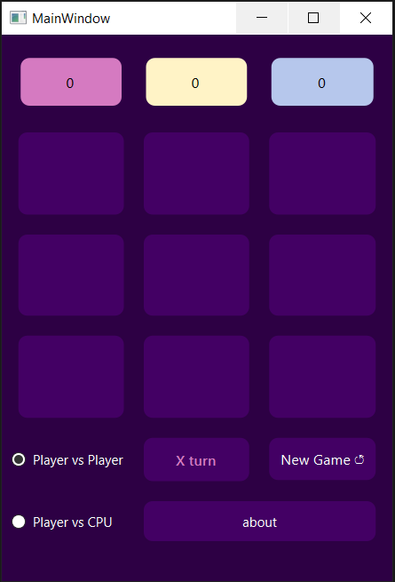
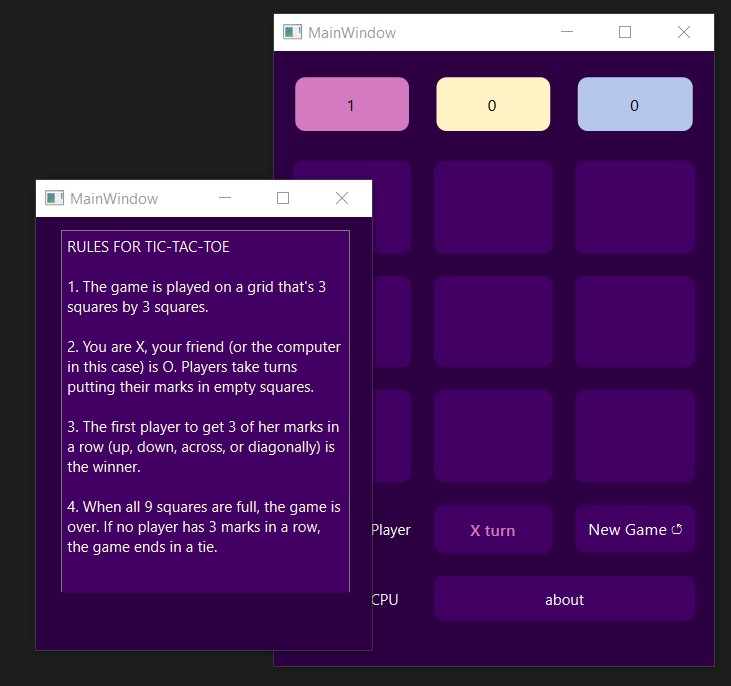

# Tic-Tac-Toe

Tic-Tac-Toe gameboard with choices to play against another player or the computer.

___

## Python

We use [pyside6](https://doc.qt.io/qtforpython/) library for designing the user interface.

You can change between modes of playing with computer or another player by swithcing between radio buttons in the left corner.

You cal also read the rules of play by pressing about button.

